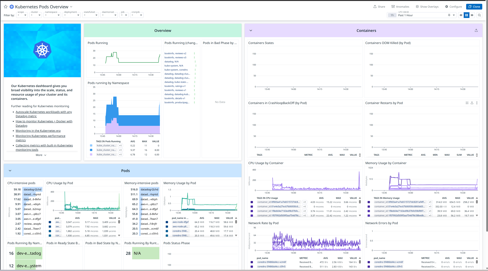

# Datadog for EKS - Terraform Deployment

Complete Infrastructure as Code (IaC) solution for deploying Datadog on Amazon EKS for centralized logging, monitoring, and APM (Application Performance Monitoring).

## Architecture Overview


This setup deploys the Datadog Agent as a DaemonSet on your EKS cluster, providing:
- **Log Collection**: Automatic collection from all containers
- **Metrics Collection**: Infrastructure and application metrics
- **APM**: Distributed tracing for applications
- **Process Monitoring**: Live process data
- **Network Monitoring**: Network traffic and connections
- **Kubernetes Monitoring**: Full visibility into K8s resources


## Components

### 1. **Datadog Agent (DaemonSet)**
- Runs on every node in the cluster
- Collects logs, metrics, and traces
- Forwards data to Datadog SaaS platform
- Minimal resource footprint (~256Mi memory, 200m CPU)

### 2. **Cluster Agent**
- Centralized metrics collection
- Cluster-level checks
- External metrics provider for HPA
- Admission controller for auto-instrumentation

### 3. **Cluster Checks Runner**
- Executes cluster-level checks
- Monitors cluster-wide resources
- Scalable check execution

## Features

✅ **Fully Automated**: One-command deployment with Terraform  
✅ **Production Ready**: RBAC, security best practices  
✅ **Zero Maintenance**: SaaS platform, no storage management  
✅ **Comprehensive Monitoring**: Logs + Metrics + APM + NPM  
✅ **Auto-Discovery**: Automatically discovers services and apps  
✅ **Advanced Alerting**: ML-powered anomaly detection  
✅ **Out-of-the-Box Dashboards**: 600+ integrations  
✅ **Real-time**: Sub-second data collection  
✅ **Kubernetes Native**: Full K8s resource visibility  
✅ **APM Built-in**: Distributed tracing without extra config  

## Prerequisites

1. **Datadog Account** - Sign up at [datadoghq.com](https://www.datadoghq.com/)
2. **Datadog API Key** - Get from [API Keys page](https://app.datadoghq.com/organization-settings/api-keys)
3. **Existing EKS Cluster** or set `create_eks_cluster = true`
4. **AWS CLI** configured with profile
5. **kubectl** configured for your EKS cluster
6. **Terraform** >= 1.0
7. **Helm** (used by Terraform provider)

### Get Datadog API Key

1. Log in to [Datadog](https://app.datadoghq.com/)
2. Go to **Organization Settings** → **API Keys**
3. Create a new API key or copy existing one
4. (Optional) Create an Application Key for advanced features

### Configure kubectl for EKS

```bash
aws eks update-kubeconfig \
  --region ap-northeast-1 \
  --name <EKS_CLUSTER_NAME> \
  --profile <AWS_CLI_PROFILE>
```

## Quick Start

### 1. Clone/Navigate to Directory

```bash
cd eks-datadog-logs-deploy-by-terraform
```

### 2. Configure terraform.tfvars

```bash
cp terraform.tfvars.example terraform.tfvars
```

Edit `terraform.tfvars`:

```hcl
aws_region   = "<AWS_REGION>"
cluster_name = "<EKS_CLUSTER_NAME>"
aws_profile  = "<AWS_CLI_PROFILE>"

# REQUIRED: Your Datadog API Key
datadog_api_key = "your-actual-api-key-here"

# OPTIONAL: Application Key
datadog_app_key = "your-app-key-here"

# Datadog Site (choose your region)
datadog_site = "datadoghq.com"  # US1
# datadog_site = "datadoghq.eu"  # EU
# datadog_site = "us3.datadoghq.com"  # US3
# datadog_site = "us5.datadoghq.com"  # US5
# datadog_site = "ap1.datadoghq.com"  # AP1

datadog_cluster_name = "<EKS_CLUSTER_NAME>"

# Feature toggles
enable_logs           = true
enable_metrics        = true
enable_apm            = true
enable_process_agent  = true
enable_cluster_checks = true
```

### 3. Deploy

```bash
chmod +x apply.sh
./apply.sh
```

The script will:
- Initialize Terraform
- Validate configuration
- Show deployment plan
- Deploy Datadog Agent
- Display access information

### 4. Access Datadog Dashboard

After deployment (2-3 minutes):

```bash
# Get Datadog URLs
terraform output datadog_dashboard_url
terraform output datadog_logs_url
terraform output datadog_apm_url
```

Visit the URLs in your browser:
- **Infrastructure**: Live map of your cluster
- **Logs**: Search and filter all container logs
- **APM**: Application traces and performance

## Manual Deployment Steps

### Initialize Terraform

```bash
terraform init
```

### Plan Deployment

```bash
terraform plan
```

### Apply Configuration

```bash
terraform apply
```

### Retrieve Outputs

```bash
# All outputs
terraform output

# Datadog dashboard URLs
terraform output datadog_dashboard_url
terraform output datadog_logs_url
terraform output datadog_apm_url

# Useful commands
terraform output -raw deployment_commands
```

## Verification

### Check Datadog Agent Pods

```bash
kubectl get pods -n datadog
```

Expected output:
```
NAME                                    READY   STATUS    RESTARTS   AGE
datadog-agent-xxxxx                     3/3     Running   0          2m
datadog-agent-xxxxx                     3/3     Running   0          2m
datadog-cluster-agent-xxxxxxxxxx-xxxxx  1/1     Running   0          2m
datadog-cluster-agent-xxxxxxxxxx-xxxxx  1/1     Running   0          2m
datadog-clusterchecks-xxxxxxxxxx-xxxxx  1/1     Running   0          2m
```

### Check Agent Status

```bash
kubectl exec -n datadog -it $(kubectl get pods -n datadog -l app=datadog -o jsonpath='{.items[0].metadata.name}') -- agent status
```

### View Agent Logs

```bash
kubectl logs -n datadog -l app=datadog --tail=50
```

### Test Log Collection

Deploy a test application:

```bash
kubectl run nginx --image=nginx -n default
kubectl logs -f nginx
```

Then check logs in Datadog:
1. Open Datadog Logs Explorer
2. Filter by `kube_namespace:default` and `pod_name:nginx`
3. You should see nginx logs appearing in real-time

## Configuration

### Variables

| Variable | Description | Default |
|----------|-------------|---------|
| `aws_region` | AWS region | `<AWS_REGION` |
| `cluster_name` | EKS cluster name | `<EKS_CLUSTER_NAME` |
| `aws_profile` | AWS CLI profile | Required |
| `datadog_api_key` | Datadog API key | **Required** |
| `datadog_app_key` | Datadog Application key | Optional |
| `datadog_site` | Datadog site | `<DATADOG_SITE>` |
| `datadog_namespace` | Kubernetes namespace | `<DATADOG_NAMESPACE>` |
| `enable_logs` | Enable log collection | `true` |
| `enable_metrics` | Enable metrics collection | `true` |
| `enable_apm` | Enable APM | `true` |
| `enable_process_agent` | Enable process monitoring | `true` |
| `enable_cluster_checks` | Enable cluster checks | `true` |

### Customize Log Collection

Edit `terraform.tfvars`:

```hcl
log_collection_config = {
  container_collect_all = true
  container_exclude     = [
    "name:datadog-agent",
    "kube_namespace:kube-system"
  ]
  container_include     = []
}
```

### Customize Agent Resources

```hcl
agent_resources_requests_cpu    = "200m"
agent_resources_requests_memory = "256Mi"
agent_resources_limits_cpu      = "500m"
agent_resources_limits_memory   = "512Mi"
```

### Advanced Configuration

Edit `helm-values/datadog-values.yaml`:

- **Add custom tags**: Modify `datadog.tags`
- **Configure integrations**: Add to `clusterAgent.confd`
- **Adjust collection**: Modify collection settings
- **Network policies**: Enable `networkPolicy.create`

## Datadog Features

### Log Management

**Access**: [Datadog Logs](https://app.datadoghq.com/logs)

Features:
- Real-time log streaming
- Advanced filtering and search
- Log patterns and analytics
- Automatic parsing of common formats
- Live tail mode
- Log archives to S3 (Optional)

**Example Queries**:
```
# All logs from production namespace
kube_namespace:production

# Error logs only
status:error

# Logs from specific container
container_name:nginx

# Logs with specific pattern
service:api AND "timeout"
```

### Infrastructure Monitoring

**Access**: [Datadog Infrastructure](https://app.datadoghq.com/infrastructure)

Features:
- Host map visualization
- Container map
- Process monitoring
- Network traffic
- Live processes
- Resource metrics (CPU, Memory, Disk, Network)

### Application Performance Monitoring (APM)

**Access**: [Datadog APM](https://app.datadoghq.com/apm/traces)

Features:
- Distributed tracing
- Service map
- Performance insights
- Error tracking
- Profiling
- Database query analysis

**Instrumentation**: Datadog can auto-instrument applications:

```yaml
# Add labels to your pods for auto-instrumentation
metadata:
  labels:
    admission.datadoghq.com/enabled: "true"
  annotations:
    admission.datadoghq.com/java-lib.version: "latest"
```

### Kubernetes Monitoring

**Access**: [Datadog Kubernetes](https://app.datadoghq.com/orchestration/overview)

- EKS Cluster Dashboard


- Bookinfo Microservices Dashboard



Features:
- Cluster overview
- Node metrics
- Pod metrics
- Deployment tracking
- Resource quotas
- Events correlation

### Alerting

Create alerts in Datadog UI:
1. Go to **Monitors** → **New Monitor**
2. Choose metric, log, or APM
3. Define conditions
4. Set notification channels

**Example Alerts**:
- Pod restart rate > threshold
- High memory usage
- Error log rate spike
- Application latency increase


## Troubleshooting

### Agent Pods Not Starting

```bash
# Check pod status
kubectl describe pod -n datadog <pod-name>

# Check events
kubectl get events -n datadog --sort-by='.lastTimestamp'
```

**Common Issues**:
- Invalid API key → Check `datadog_api_key` in terraform.tfvars
- Resource limits → Increase agent resources
- RBAC issues → Verify ServiceAccount permissions

### No Logs Appearing in Datadog

```bash
# Check agent status
kubectl exec -n datadog -it $(kubectl get pods -n datadog -l app=datadog -o jsonpath='{.items[0].metadata.name}') -- agent status

# Look for "Logs Agent" section
```

**Solutions**:
- Verify `enable_logs = true`
- Check container log paths are accessible
- Ensure logs are not excluded by filters
- Wait 2-3 minutes for initial sync

### APM Not Working

**Enable APM in your application**:

For Java:
```yaml
env:
  - name: DD_AGENT_HOST
    valueFrom:
      fieldRef:
        fieldPath: status.hostIP
  - name: DD_TRACE_AGENT_PORT
    value: "8126"
```

Or use auto-instrumentation (easier):
```yaml
metadata:
  labels:
    admission.datadoghq.com/enabled: "true"
```

### High Resource Usage

Reduce agent resources or disable features:

```hcl
# terraform.tfvars
enable_apm = false
enable_process_agent = false

log_collection_config = {
  container_collect_all = false
  container_include     = ["kube_namespace:production"]
}
```
## Cleanup

### Using Script

```bash
chmod +x destroy.sh
./destroy.sh
```

### Manual Cleanup

```bash
terraform destroy
```

This will remove:
- Datadog Agent DaemonSet
- Cluster Agent deployment
- Datadog namespace
- Kubernetes secrets
- (Optional) EKS cluster if created

**Note**: Data in Datadog cloud platform is retained per your account settings.


## File Structure

```
eks-datadog-logs-deploy-by-terraform/
├── main.tf                     # Provider configurations
├── versions.tf                 # Terraform and provider versions
├── variables.tf                # Input variables
├── terraform.tfvars.example    # Example variable values
├── eks-cluster.tf             # EKS cluster configuration
├── datadog.tf                 # Datadog agent deployment
├── outputs.tf                 # Output values
├── apply.sh                   # Deployment script
├── destroy.sh                 # Cleanup script
├── README.md                  # This file
└── helm-values/
    └── datadog-values.yaml    # Datadog Helm values template
```

## Best Practices

### Security

✅ **Store API keys securely**: Use environment variables or AWS Secrets Manager  
✅ **Enable RBAC**: Helm chart creates proper ServiceAccounts  
✅ **Use TLS**: All data encrypted in transit to Datadog  
✅ **Log filtering**: Exclude sensitive data with patterns  
✅ **Regular updates**: Keep agent version current  

### Performance

✅ **Resource limits**: Set appropriate limits for agents  
✅ **Log sampling**: Use sampling for high-volume logs  
✅ **Efficient queries**: Use indexed fields in log queries  
✅ **Disable unused features**: Turn off APM if not needed  

### Operations

✅ **Monitoring**: Set up alerts for agent health  
✅ **Log retention**: Configure based on compliance needs  
✅ **Cost tracking**: Monitor Datadog usage regularly  
✅ **Documentation**: Document custom integrations  
✅ **Testing**: Use test environments before production  


## Support & Resources

- **Datadog Documentation**: https://docs.datadoghq.com/
- **Datadog Kubernetes Integration**: https://docs.datadoghq.com/integrations/kubernetes/
- **Helm Chart Repository**: https://github.com/DataDog/helm-charts
- **Datadog Community**: https://www.datadoghq.com/community/
- **API Reference**: https://docs.datadoghq.com/api/

## Comparison Summary

### When to Use Datadog
- Want minimal operational overhead
- Need comprehensive monitoring (logs + metrics + APM)
- Require advanced alerting and ML features
- Have budget for managed service
- Want out-of-the-box integrations
- Need compliance and security features

### When to Use ELK Stack
- Need full control over data storage
- Have compliance requiring on-premise logs
- Want to avoid per-host pricing
- Have team expertise in Elasticsearch
- Need custom log processing
- Tight budget constraints
---

**Created**: 2025  
**Author**: Infrastructure Team  
**Purpose**: Datadog monitoring for EKS clusters
